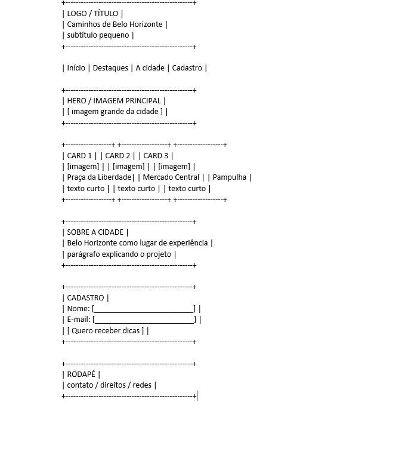
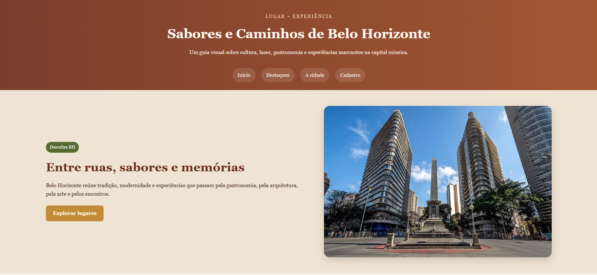
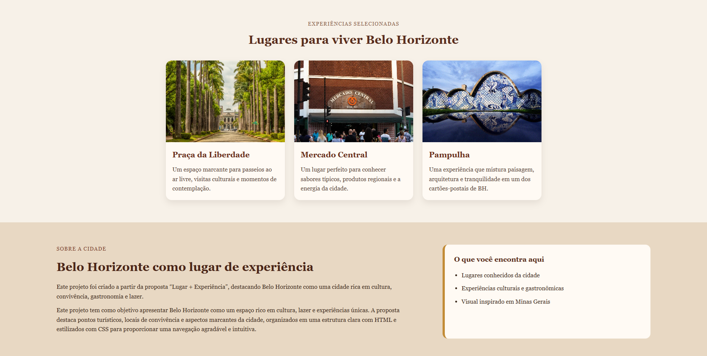
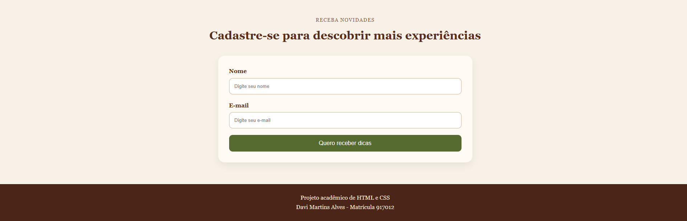

# Trabalho Prático - Semana 04

Dessa vez, vamos escolher uma proposta de projeto para trabalhar.

Nessa atividade, você deverá montar a página inicial do projeto escolhido, a organização do HTML aplicando semântica correta e uso aprimorado do CSS. Leia o enunciado completo no Canvas para mais detalhes.

**IMPORTANTE:** Você deve trabalhar e alterar apenas arquivos dentro da pasta **`public`**. Deixe todos os demais arquivos e pastas desse repositório inalterados. **PRESTE MUITA ATENÇÃO NISSO.**

## Informações Gerais

- Nome: Davi Martins Alves
- Matricula:917012
- Proposta de projeto escolhida: Sabores e Caminhos de Belo Horizonte
- Breve descrição sobre seu projeto: Este projeto foi criado a partir da proposta “Lugar + Experiência”, destacando Belo Horizonte como uma cidade rica em cultura, convivência, gastronomia e lazer.Este projeto tem como objetivo apresentar Belo Horizonte como um espaço rico em cultura, lazer e experiências únicas. A proposta destaca pontos turísticos, locais de convivência e aspectos marcantes da cidade, organizados em uma estrutura clara com HTML e estilizados com CSS para proporcionar uma navegação agradável e intuitiva.
## Print do(s) wireframe(s) criado

## Print da home-page criada

### Topo

### Conteúdo

### Rodapé

